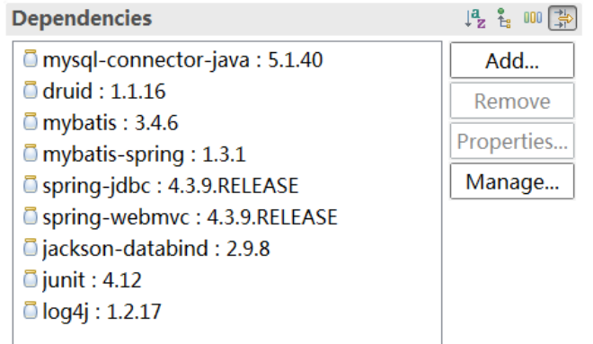

```xml
<?xml version="1.0" encoding="UTF-8"?>
<beans
    xmlns="http://www.springframework.org/schema/beans" 
    xmlns:p="http://www.springframework.org/schema/p"
    xmlns:xsi="http://www.w3.org/2001/XMLSchema-instance" 
    xmlns:context="http://www.springframework.org/schema/context"
    xmlns:tx="http://www.springframework.org/schema/tx"
    xmlns:aop="http://www.springframework.org/schema/aop" 
    xmlns:mvc="http://www.springframework.org/schema/mvc"
    xmlns:util="http://www.springframework.org/schema/util"
    xmlns:jpa="http://www.springframework.org/schema/data/jpa"
    xsi:schemaLocation="  
       http://www.springframework.org/schema/beans   
       http://www.springframework.org/schema/beans/spring-beans-4.3.xsd  
       http://www.springframework.org/schema/mvc   
       http://www.springframework.org/schema/mvc/spring-mvc-4.3.xsd   
       http://www.springframework.org/schema/tx   
       http://www.springframework.org/schema/tx/spring-tx-4.3.xsd   
       http://www.springframework.org/schema/aop 
       http://www.springframework.org/schema/aop/spring-aop-4.3.xsd
       http://www.springframework.org/schema/util 
       http://www.springframework.org/schema/util/spring-util-4.3.xsd
       http://www.springframework.org/schema/data/jpa 
       http://www.springframework.org/schema/data/jpa/spring-jpa-1.3.xsd
       http://www.springframework.org/schema/context
       http://www.springframework.org/schema/context/spring-context-4.3.xsd">
       
      
</beans>
```

```properties
jdbcDriver=com.mysql.jdbc.Driver
jdbcUrl=jdbc:mysql:///jtsys?useUnicode=true&characterEncoding=utf-8
jdbcUser=root
jdbcPassword=321
```

```properties
log4j.rootLogger=INFO,stdout
log4j.appender.stdout=org.apache.log4j.ConsoleAppender
log4j.appender.stdout.layout=org.apache.log4j.PatternLayout
log4j.appender.stdout.layout.ConversionPattern=%d [%-5p] %c - %m%n
log4j.logger.com.db=DEBUG
```


```properties
&serverTimezone=Asia/Shanghai
```


spring整合mybatis时系统会**将事务控制切换到spring**，然后需要如下依赖

```XML
<dependency>
    <groupId>org.springframework</groupId>
    <artifactId>spring-jdbc</artifactId>
    <version>4.3.9.RELEASE</version>
</dependency>
```


```xml
<!DOCTYPE mapper PUBLIC "-//mybatis.org//DTD Mapper 3.0//EN"
  "http://mybatis.org/dtd/mybatis-3-mapper.dtd">
```


# Jackson

```xml

<mvc:annotation-driven>
    <mvc:message-converters>
        <bean class="org.springframework.http.converter.json.MappingJackson2HttpMessageConverter">
            <property name="objectMapper">
                <bean class="com.fasterxml.jackson.databind.ObjectMapper">
                    <!-- 处理responseBody 里面日期类型 -->
                    <property name="dateFormat">
                        <bean class="java.text.SimpleDateFormat">
                            <constructor-arg type="java.lang.String" value="yyyy-MM-dd HH:mm:ss" />
                        </bean>
                    </property>
                    <!-- 为null字段时不显示 -->
                    <property name="serializationInclusion">
                        <value type="com.fasterxml.jackson.annotation.JsonInclude.Include">NON_NULL</value>
                    </property>
                </bean>
            </property>
        </bean>
    </mvc:message-converters>
</mvc:annotation-driven>
```


# @Transactional 的使用要求：

- @Transactional 注解只能应用到 public访问权限的方法上 。 如果你在 protected、private 或者  package-visible 的方法上使用 @Transactional 注解，它也不会报错， 但是这个被注解的方法将不起事务作用。
- @Transactional 注解可以被应用于接口和接口方法、类和类的 public 方法上 。
- @Transactional 注解的使用，必须在配置文件中配置事务相关信息。
- 因为spring事务是基于类和接口的，所以只能在类里面调用另一个类里面的事务，同一个类里面调用自己类的事务方法是无效的。

```XML
<bean id="transactionManager"
      class="org.springframework.jdbc.datasource.DataSourceTransactionManager">
    <property name="dataSource" ref="ds" />
</bean>
<tx:annotation-driven transaction-manager="transactionManager" />
```

